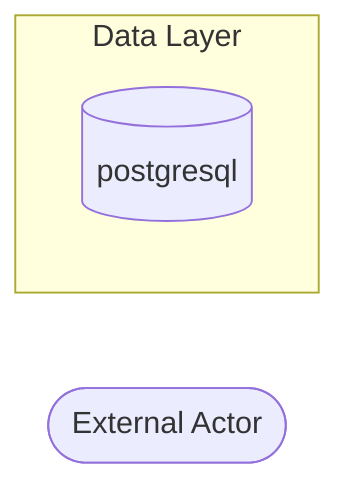

# Threat Model Report

**Generated:** 2026-04-10 12:36:12
**Repository:** /Users/mlieberman/Projects/baseline-mcp
**Frameworks Detected:** None detected

## Executive Summary

🟡 **1 MEDIUM** severity threats should be reviewed.

| Risk Level | Count |
|------------|-------|
| 🔴 Critical | 0 |
| 🟠 High | 0 |
| 🟡 Medium | 1 |
| 🟢 Low | 0 |
| ℹ️ Info | 0 |

## Asset Inventory

### Entry Points

No API entry points detected.

### Authentication Mechanisms

⚠️ No authentication framework detected.

### Data Stores

- **postgresql** (database) - packages/darnit-gittuf/src/darnit_gittuf/handlers.py:84

## Data Flow Diagram



## Threat Analysis (STRIDE)

### Spoofing

No threats identified. Checked for unauthenticated endpoints and missing identity verification.

### Tampering

No threats identified. Checked for injection vulnerabilities (SQL, command, XSS, path traversal, SSRF, code injection).

### Repudiation

No threats identified. Checked for insufficient audit logging on security-relevant actions.

### Information Disclosure

#### 🟡 TM-I-001: PII Data Handling Review Required

**Risk Score:** 0.50 (MEDIUM)

**Description:** Found 10 fields that may contain PII. Review data handling, storage, and transmission practices.

**Attack Vector:** Data breach, unauthorized access, logging exposure

**Exploitation Scenario:**

1. Attacker exploits an application vulnerability to gain database or API access
2. Attacker queries or exports personally identifiable information (PII) records
3. PII data is exfiltrated without encryption or access controls in place
4. Exposed individuals face identity theft, fraud, or privacy violations

**Data Flow Impact:** application vulnerability → database/API access → PII extraction → identity theft risk

**Code Locations:**
- `packages/darnit/src/darnit/context/sieve.py:660` - PII field: email

```python
     655 |                 # Format: "   123\tName <email>"
     656 |                 match = re.match(r"\s*\d+\s+(.+?)\s*<(.+?)>", line)
     657 |                 if not match:
     658 |                     continue
     659 |                 name = match.group(1).strip()
>>>  660 |                 email = match.group(2).strip()
     661 | 
     662 |                 if name in bot_names or "[bot]" in name:
     663 |                     continue
     664 | 
     665 |                 # Try to extract GitHub username from noreply email
```
- `packages/darnit/src/darnit/context/collection.py:405` - PII field: email

```python
     400 |         if isinstance(value, str):
     401 |             # Accept path to file or comma-separated values
     402 |             return True, None
     403 |         return False, "Expected a list or path"
     404 | 
>>>  405 |     elif ctx_type == "email":
     406 |         if isinstance(value, str):
     407 |             if re.match(r"^[^@]+@[^@]+\.[^@]+$", value):
     408 |                 return True, None
     409 |         return False, "Expected a valid email address"
     410 | 
```
- `packages/darnit/src/darnit/context/dot_project.py:59` - PII field: email

```python
      54 |     Supports both simple handles and the CNCF structured format
      55 |     with handle, email, role, and title.
      56 |     """
      57 | 
      58 |     handle: str = ""
>>>   59 |     email: str = ""
      60 |     role: str = ""
      61 |     title: str = ""
      62 |     name: str = ""
      63 | 
      64 |     # Allow unknown fields for forward compatibility
```

**Recommended Controls:**

| Control | Effectiveness | Rationale |
|---------|--------------|-----------|
| Encrypt PII at rest and in transit | high | Renders extracted data unusable without encryption keys |
| Implement access logging for PII access | high | Enables detection of unauthorized data access |
| Define data retention policies | medium | Minimizes the amount of PII available for exfiltration |
| Ensure GDPR/CCPA compliance | medium | Provides legal framework for data protection practices |

**References:**
- GDPR Article 32
- OWASP Data Protection Cheat Sheet

### Denial Of Service

No threats identified. Checked for public endpoints without rate limiting.

### Elevation Of Privilege

No threats identified. Checked for server actions without authorization and injection-based privilege escalation.

## Attack Chains

No compound attack paths identified.

## Recommendations Summary

### Immediate Actions (Critical/High)

No critical or high severity threats identified.

### Short-term Actions (Medium)

1. **PII Data Handling Review Required**

## Methodology

This threat model was generated using automated static analysis with the STRIDE methodology:

- **S**poofing - Identity verification threats
- **T**ampering - Data integrity threats
- **R**epudiation - Audit and accountability threats
- **I**nformation Disclosure - Confidentiality threats
- **D**enial of Service - Availability threats
- **E**levation of Privilege - Authorization threats

### Limitations

- Static analysis only - runtime behavior not analyzed
- Pattern-based detection may have false positives/negatives
- Business context and risk priorities require human review
- This is not a substitute for professional penetration testing
